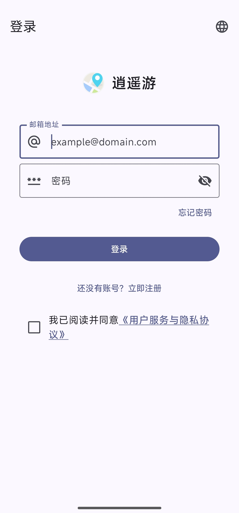
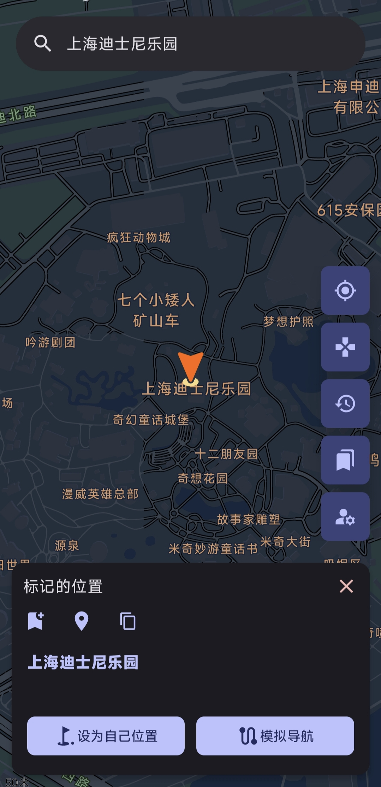
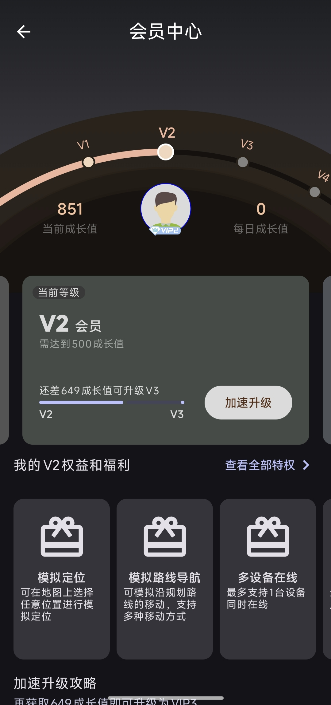

# position-app
安卓考勤-远程打卡软件【逍遥游】

# 🌐 逍遥游 - 智能位置模拟专家

> **不止于打卡，更在于掌控。** 逍遥游是专为安卓用户打造的、安全高效的位置模拟与路线导航工具。无需越狱，轻松应对各类基于位置的办公、考勤与生活场景。

*✨ 告别地理位置限制，开启智能移动办公新体验。✨*

## ✨ 核心亮点

| 特性 | 描述 |
|:--- |:--- |
| **📍 精准定点模拟** | 在地图上任意选取位置，一键切换，定位精准无偏差。 |
| **🚗 智能路线导航** | 模拟真实移动轨迹，支持步行、驾车等多种模式，速度可调。 |
| **📱 多设备支持** | 支持多台安卓设备同时在线管理，满足多场景切换需求。 |
| **🎯 场景化专精** | **完美适配“钉钉”、“薪人薪事”** 等主流办公考勤应用。 |
| **🏆 成长会员体系** | 通过使用积累成长值，解锁更高会员等级和更强大的专属特权。 |

### ⚠️ 重要兼容性说明
- **✅ 完美支持**：**钉钉 (DingTalk)、薪人薪事** 等企业级应用。
- **❌ 暂不支持**：**企业微信 (WeCom Work)、iOS 系统**。我们专注于安卓生态的深度优化。

---

## 📸 应用预览

  <table>
    <tr>
      <td align="center"><strong>登录与首页</strong></td>
      <td align="center"><strong>位置模拟</strong></td>
      <td align="center"><strong>会员中心</strong></td>
    </tr>
    <tr>
      <td align="center">
        

          
        

      </td>
      <td align="center">
        

          
        

      </td>
      <td align="center">
        

          
        

      </td>
    </tr>
    <tr>
      <td align="center" style="padding-top: 12px; color: #666; font-size: 0.9em; width: 280px;">
        简洁专业的登录界面，轻松开启智能位置管理之旅。
      </td>
      <td align="center" style="padding-top: 12px; color: #666; font-size: 0.9em; width: 280px;">
        在地图上直观选择目标位置，或规划模拟导航路线。
      </td>
      <td align="center" style="padding-top: 12px; color: #666; font-size: 0.9em; width: 280px;">
        清晰的成长体系与等级特权，激励您探索更多功能。
      </td>
    </tr>
  </table>

---

## 🛠️ 功能详解

### 1. **核心位置服务**
- **自由选点**：像使用普通地图一样，点击即可将任意位置设为你的“当前位置”。
- **路线模拟**：设置起点和终点，App将模拟沿真实道路移动，产生连续的、真实的定位数据流。

### 2. **多设备管理**
- 同一账号可管理多台安卓设备，方便您在手机、平板或备用机之间自由切换模拟状态。

### 3. **VIP 成长体系**
随着使用，您将自然积累成长值并提升会员等级，享受更多进阶功能：
- **V1 基础版**：体验基础定位功能。
- **V2 专业版**：解锁**模拟路线导航**与**多设备在线**支持。
- **V3 尊享版**：享受更高级的模拟模式与独家定制功能。

> **💡 升级提示**：查看会员中心的“加速升级攻略”，快速了解如何高效获得成长值。

### 4. **广泛的场景应用**
逍遥游致力于解决真实世界的需求：
- **远程办公考勤**：在家或外出时，也能在“钉钉”、“薪人薪事”上完成位置打卡。
- **位置社交**：保护真实隐私，安全参与基于位置的服务。
- **游戏与测试**：协助开发者进行基于LBS的应用功能测试。

---

## 🚀 如何获取与开始

**逍遥游**目前处于**邀请制内测阶段**，以确保服务质量和用户体验。

1.  **资源获取或问题反馈**：请前往下方 **[交流社区](#-加入我们的交流社区)** 的微信群或QQ群。
2.  **下载APK**：在社区群文件中下载最新版本的 `locaMagic-release-v1.0.1.apk` 安装文件。
3.  **安卓手机安装**：
    - 在手机设置中开启 **“允许安装来自未知来源的应用”**。
    - 找到下载的APK文件并安装。
4.  **注册与登录**：打开App，使用邮箱完成注册，即可登录体验。
5.  **阅读协议**：请务必在使用前阅读并同意 **《用户服务与隐私协议》**。

---

## ❓ 常见问题

**Q：为什么企业微信和iOS不能用？**
A：企业微信和iOS系统对位置信息有极其严格和底层的保护机制，技术上难以在不越狱或进行高风险操作的情况下实现模拟。我们优先确保在主流且可行的平台（如钉钉、薪人薪事及大多数安卓应用）上提供**稳定、安全**的服务。

**Q：使用安全吗？会被检测吗？**
A：逍遥游采用先进的模拟技术，力求稳定隐蔽。但请注意，任何修改位置的行为都可能违反某些应用（如游戏、核心考勤系统）的服务条款，请务必在合理合法范围内使用，我们不对滥用行为负责。

**Q：如何快速升级会员等级？**
A：每日使用核心功能、完成引导任务或参与内测反馈均可获得成长值，详情请查看App内“加速升级攻略”。

---

## 📄 协议与隐私

使用本应用即表示您同意我们的 **《用户服务与隐私协议》**。
- 我们**不会**收集您的任何账号密码等敏感信息。
- 部分必要的位置数据仅用于在您设备本地完成模拟功能，不会上传至我们的服务器。
- 我们致力于保护您的隐私，所有数据传输均进行加密。

---

## 🤝 贡献与反馈

逍遥游正在快速成长，欢迎您的反馈：
- **问题与建议**：请前往下方 **[交流社区](#-加入我们的交流社区)** 反馈。
- **功能投票**：在社区中告诉我们你最期待的下一个功能。
- **内测反馈**：加入我们的内测社区，与开发者直接交流。

---

### 📢 加入我们的交流社区

欢迎加入以下官方社区，与开发者和其他用户交流心得、反馈问题、获取最新资源和内测信息！

| 平台 | 图标 | 加入方式 | 说明 |
| :--- | :--- | :--- | :--- |
| **微信** |  |    **扫码添加（备注：逍遥游）** | 最活跃的**核心用户群**，反馈问题最及时，内测更新优先通知。 |
| **QQ** |  |    **扫码加入（群号已包含）** | **资源分享大本营**，群文件内有历史版本、教程文档等丰富资源。社区Q群号: 868394597 |
| **Discord** |  | [点击链接加入频道](https://discord.gg/CtTXK3Avu) | **国际用户 & 技术讨论**，适合与开发者进行深入的功能探讨。 https://discord.gg/CtTXK3Avu |
| **Telegram** |  | [点击链接加入群组](https://t.me/+9rNGusxGKEYzMGQ1) | **信息发布与轻交流**，用于同步公告、更新日志和碎片化讨论。 https://t.me/+9rNGusxGKEYzMGQ1|

**使用提示：**
群里有对应的安装使用教程，定期分享新资料，欢迎进群讨论。
